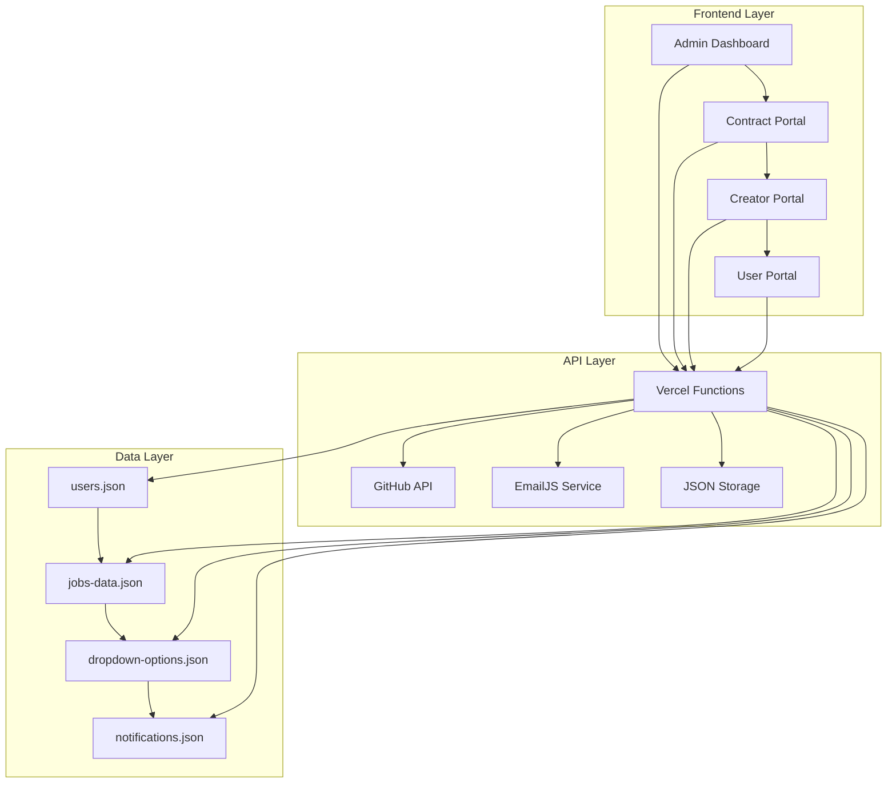
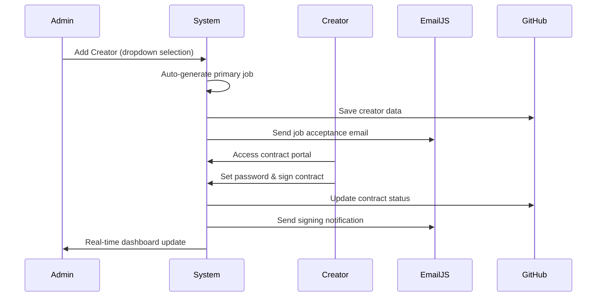
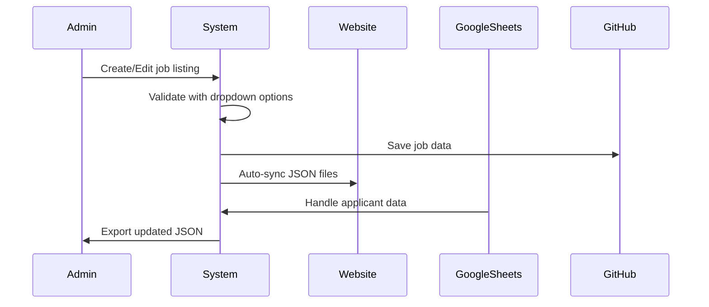

# 🎬 Cochran Films - Revolutionary Centralized Creator Management Platform

<div align="center">


<br>

<div style="display: flex; justify-content: center; align-items: center; gap: 20px; margin: 20px 0;">

<div style="text-align: center; padding: 20px; background: linear-gradient(135deg, #FFB200, #FF8C00); border-radius: 15px; color: #1a1a1a; font-weight: bold; box-shadow: 0 8px 32px rgba(255, 178, 0, 0.3); transform: perspective(1000px) rotateY(-15deg);">

### 🚀 **Creator Management**
- Automated onboarding
- Digital contracts
- Real-time tracking

</div>

<div style="text-align: center; padding: 20px; background: linear-gradient(135deg, #22c55e, #16a34a); border-radius: 15px; color: white; font-weight: bold; box-shadow: 0 8px 32px rgba(34, 197, 94, 0.3); transform: perspective(1000px) rotateY(15deg);">

### 📋 **Job Management**
- Centralized listings
- Auto-sync with website
- Google Sheets integration

</div>

<div style="text-align: center; padding: 20px; background: linear-gradient(135deg, #3B82F6, #2563eb); border-radius: 15px; color: white; font-weight: bold; box-shadow: 0 8px 32px rgba(59, 130, 246, 0.3); transform: perspective(1000px) rotateY(-15deg);">

### 🔐 **Secure Infrastructure**
- GitHub API integration
- Server-side token handling
- EmailJS notifications

</div>

</div>

</div>

---

## 🎯 **Platform Overview**

Cochran Films has revolutionized creator management with a **revolutionary centralized architecture** that eliminates data fragmentation and provides a single source of truth. This enterprise-grade platform combines cutting-edge technology with unified data structure to deliver a seamless experience for both creators and administrators.

### 🌟 **Key Innovations**

<details>
<summary><strong>🎬 Revolutionary Centralized Creator Management System</strong></summary>

- **Centralized Data Architecture**: Single source of truth eliminating fragmentation issues
- **Automated Onboarding**: Dropdown-driven creator registration with managed options
- **Smart Job Creation**: Primary jobs automatically generated from creator profiles
- **Instant Approval**: One-click approval system with automated email notifications
- **Password-Free Setup**: Creators set their own passwords during contract signing
- **Real-Time Tracking**: Live dashboard updates for all creator activities
- **Contract Automation**: Digital signature validation with instant PDF generation
- **Integrated Performance Reviews**: Seamlessly embedded in user profiles
- **Unified Data Structure**: All creator data consolidated in users.json

</details>

<details>
<summary><strong>📋 Intelligent Job Management</strong></summary>

- **Centralized Control**: Single admin panel for all job listings
- **Auto-Sync Integration**: Seamless updates to website JSON files
- **Google Sheets Integration**: Automated applicant data handling
- **Managed Dropdowns**: Consistent data entry with controlled options
- **Export Capabilities**: One-click JSON export for website updates
- **Status Tracking**: Real-time job status and application monitoring

</details>

<details>
<summary><strong>🔐 Revolutionary Security & Data Architecture</strong></summary>

- **Centralized Data Architecture**: Single source of truth eliminating fragmentation
- **Server-Side Token Handling**: GitHub tokens never exposed to client
- **Vercel API Functions**: Scalable, secure backend infrastructure
- **EmailJS Integration**: Professional notification system
- **CORS-Free Design**: Direct API communication without proxies
- **Environment Variables**: Secure configuration management
- **Digital Signature Validation**: Cryptographic contract verification
- **Data Integrity Protection**: Automatic backup and validation systems
- **Fragmentation Elimination**: Revolutionary unified data structure

</details>

---

## 🏗️ **System Architecture**



---

## 🚀 **Quick Start Guide**

### **1. Environment Setup**

```bash
# Clone the repository
git clone https://github.com/cochranfilms/cochran-job-listings.git
cd cochran-films-landing

# Install dependencies
npm install
```

### **2. Configuration**

Create a `.env` file in the project root:

```env
# GitHub Configuration
GITHUB_TOKEN=ghp_your_actual_token_here
GITHUB_OWNER=cochranfilms
GITHUB_REPO=cochran-job-listings
GITHUB_BRANCH=main

# Server Configuration
PORT=3000

# EmailJS Configuration (for contract notifications)
EMAILJS_PUBLIC_KEY=your_public_key
EMAILJS_SERVICE_ID=your_service_id
EMAILJS_TEMPLATE_ID=your_template_id
```

### **3. Launch Application**

```bash
# Development mode with auto-restart
npm run dev

# Production mode
npm start
```

### **4. Access Points**

| **Portal** | **URL** | **Purpose** |
|------------|---------|-------------|
| 🎬 **Contract Portal** | `http://localhost:3000/contract.html` | Creator contract signing |
| 📊 **Admin Dashboard** | `http://localhost:3000/admin-dashboard.html` | Management interface |
| 👥 **Creator Portal** | `http://localhost:3000/user-portal.html` | Creator access |
| 📚 **Documentation** | `http://localhost:3000/backend.html` | System documentation |

---

## 🔧 **API Endpoints**

### **GitHub Integration**
```http
GET    /api/github/info                    # Repository information
GET    /api/github/file/:filename          # Get file contents
PUT    /api/github/file/:filename          # Update file contents
POST   /api/github/upload/:filename        # Upload files (PDFs)
```

### **Contract Management**
```http
GET    /api/contracts                      # List all contracts
POST   /api/contracts                      # Create new contract
PUT    /api/contracts/:id                  # Update contract
DELETE /api/contracts/:id                  # Delete contract
```

### **User Management**
```http
GET    /api/users                          # List all users
POST   /api/users                          # Create new user
PUT    /api/users/:id                      # Update user
DELETE /api/users/:id                      # Delete user
```

### **Job Management**
```http
GET    /api/jobs                           # List all jobs
POST   /api/jobs                           # Create new job
PUT    /api/jobs/:id                       # Update job
DELETE /api/jobs/:id                       # Delete job
```

---

## 📊 **Workflow Automation**

### **Creator Onboarding Process**



### **Job Management Process**



---

## 🛡️ **Security Features**

| **Feature** | **Implementation** | **Benefit** |
|-------------|-------------------|-------------|
| 🔐 **Token Security** | Server-side GitHub token handling | No exposed credentials |
| 🚫 **CORS-Free** | Direct API communication | No proxy vulnerabilities |
| 🔒 **Environment Variables** | Secure configuration management | Centralized security |
| 📧 **EmailJS Integration** | Professional notification system | Reliable communications |
| ✍️ **Digital Signatures** | Cryptographic validation | Legal compliance |
| 🔄 **Real-Time Updates** | Live dashboard synchronization | Instant status tracking |

---

## 📁 **File Structure**

```
cochran-films-landing/
├── 🎬 Core Application
│   ├── admin-dashboard.html      # Main admin interface
│   ├── contract.html             # Contract signing portal
│   ├── user-portal.html          # Creator access portal
│   └── backend.html              # System documentation
│
├── 🔧 API Layer
│   ├── api/
│   │   ├── contracts.js          # Contract management
│   │   ├── users.js              # User management
│   │   ├── jobs.js               # Job management
│   │   └── github/               # GitHub integration
│   └── server.js                 # Main server file
│
├── 📊 Data Storage
│   ├── users.json                # Centralized creator data (profiles, contracts, jobs, performance)
│   ├── jobs-data.json            # Job listings
│   ├── dropdown-options.json     # System options
│   └── notifications.json        # System notifications
│
├── 🎨 Assets & Templates
│   ├── contracts/                # PDF contract storage
│   ├── Email-Signature.html      # Email templates
│   └── templates/                # System templates
│
└── 📚 Documentation
    ├── README.md                 # This file
    ├── WORKFLOW_GUIDE.md         # Detailed workflow
    └── DEMO_LOGIN_GUIDE.md      # Demo instructions
```

---

## 🎯 **Key Features**

### **🎬 Revolutionary Creator Management**
- ✅ **Centralized Data Architecture**: Single source of truth
- ✅ **Automated Onboarding**: Dropdown-driven registration
- ✅ **Smart Job Creation**: Auto-generated primary jobs
- ✅ **Instant Approval**: One-click approval system
- ✅ **Password-Free Setup**: Creator-defined passwords
- ✅ **Real-Time Tracking**: Live dashboard updates
- ✅ **Contract Automation**: Digital signature validation
- ✅ **Integrated Performance Reviews**: Seamlessly embedded in profiles
- ✅ **Fragmentation Elimination**: Unified data structure

### **📋 Job Management**
- ✅ **Centralized Control**: Single admin panel
- ✅ **Auto-Sync Integration**: Website JSON updates
- ✅ **Google Sheets Integration**: Applicant data handling
- ✅ **Managed Dropdowns**: Consistent data entry
- ✅ **Export Capabilities**: One-click JSON export
- ✅ **Status Tracking**: Real-time monitoring

### **🔐 Revolutionary Security & Infrastructure**
- ✅ **Centralized Data Architecture**: Single source of truth
- ✅ **Server-Side Tokens**: Secure GitHub integration
- ✅ **Vercel API Functions**: Scalable backend
- ✅ **EmailJS Notifications**: Professional alerts
- ✅ **CORS-Free Design**: Direct API communication
- ✅ **Environment Variables**: Secure configuration
- ✅ **Digital Signatures**: Cryptographic validation
- ✅ **Fragmentation Elimination**: Revolutionary unified structure
- ✅ **Data Integrity Protection**: Enhanced validation systems

---

## 🚀 **Deployment**

### **Local Development**
```bash
npm run dev  # Uses nodemon for auto-restart
```

### **Production Deployment**
```bash
npm start    # Standard Node.js server
```

### **Environment Variables for Production**
Set these environment variables on your hosting platform:

| **Variable** | **Description** | **Default** |
|--------------|-----------------|-------------|
| `GITHUB_TOKEN` | GitHub Personal Access Token | Required |
| `GITHUB_OWNER` | Repository owner | `cochranfilms` |
| `GITHUB_REPO` | Repository name | `cochran-job-listings` |
| `GITHUB_BRANCH` | Branch name | `main` |
| `PORT` | Server port | `3000` |
| `EMAILJS_PUBLIC_KEY` | EmailJS public key | Required |
| `EMAILJS_SERVICE_ID` | EmailJS service ID | Required |
| `EMAILJS_TEMPLATE_ID` | EmailJS template ID | Required |

---

## 🔑 **GitHub Token Setup**

1. **Access GitHub Settings**
   - Go to GitHub → Settings → Developer settings → Personal access tokens

2. **Generate Token**
   - Click "Generate new token (classic)"
   - Select `repo` permissions
   - Set expiration as needed

3. **Configure Environment**
   - Copy the token
   - Add to your `.env` file as `GITHUB_TOKEN`
   - Never commit the `.env` file

4. **Verify Permissions**
   - Ensure the token has access to your repository
   - Test with a simple API call

---

## 📝 **Usage Guide**

### **For Administrators**

1. **Access Admin Dashboard**
   - Navigate to `/admin-dashboard.html`
   - Use the comprehensive management interface

2. **Manage Creators**
   - Add new creators with dropdown selections
   - Approve creators with one-click approval
   - Monitor contract signing progress
   - Track password status and access

3. **Manage Jobs**
   - Create and edit job listings
   - Use managed dropdown options for consistency
   - Export updated JSON files for website
   - Monitor application status

4. **Monitor Contracts**
   - View all uploaded contracts
   - Track signing progress
   - Receive email notifications
   - Export contract data

### **For Creators**

1. **Contract Signing**
   - Access the contract portal
   - Enter required information
   - Set your own password
   - Sign the contract digitally
   - Receive instant PDF download

2. **Portal Access**
   - Use your email and password
   - View your contract status
   - Access assigned jobs
   - Download signed documents

---

## 🔍 **Troubleshooting**

### **Common Issues & Solutions**

<details>
<summary><strong>🔧 GitHub Token Issues</strong></summary>

**Problem**: "GitHub token not configured"
- **Solution**: Verify `.env` file has `GITHUB_TOKEN` set
- **Check**: Ensure token has `repo` permissions

**Problem**: "API calls failing"
- **Solution**: Verify GitHub token is valid
- **Check**: Test repository permissions

</details>

<details>
<summary><strong>🚀 Server Issues</strong></summary>

**Problem**: "Server not starting"
- **Solution**: Run `npm install` to install dependencies
- **Check**: Verify port 3000 is available

**Problem**: "Environment variables missing"
- **Solution**: Create `.env` file with required variables
- **Check**: Verify all required variables are set

</details>

<details>
<summary><strong>📧 EmailJS Issues</strong></summary>

**Problem**: "Email notifications not working"
- **Solution**: Configure EmailJS credentials in contract.html
- **Check**: Verify service and template IDs

**Problem**: "Contract signing notifications missing"
- **Solution**: Test EmailJS configuration
- **Check**: Verify template variables are correct

</details>

---

## 📞 **Support & Documentation**

### **📚 Additional Resources**

- **📖 [Complete Workflow Guide](WORKFLOW_GUIDE.md)** - Detailed system documentation
- **🎬 [Demo Login Guide](DEMO_LOGIN_GUIDE.md)** - Demo account instructions
- **🔧 [Backend Documentation](backend.html)** - Technical system overview
- **📧 [Email Setup Guide](GOOGLE_SHEET_SETUP_GUIDE.md)** - EmailJS configuration

### **🆘 Getting Help**

1. **Check Console Logs** - Review browser and server console for errors
2. **Verify Configuration** - Ensure all environment variables are set correctly
3. **Test API Endpoints** - Use the test endpoints to verify functionality
4. **Review Documentation** - Consult the comprehensive documentation files

---

## 🏆 **Platform Status**

<div align="center">


**✅ Revolutionary centralized creator management platform ready for production use!**

</div>

---

<div align="center">

**🎬 Built with ❤️ by [Cochran Films](https://cochranfilms.com)**

**🚀 Revolutionary centralized creator management platform**

**🔐 Secure, scalable, and sophisticated**

</div> 